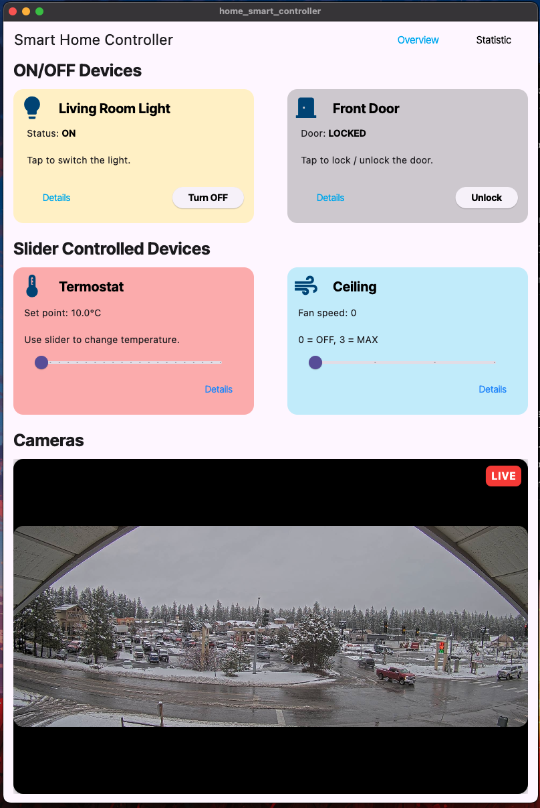
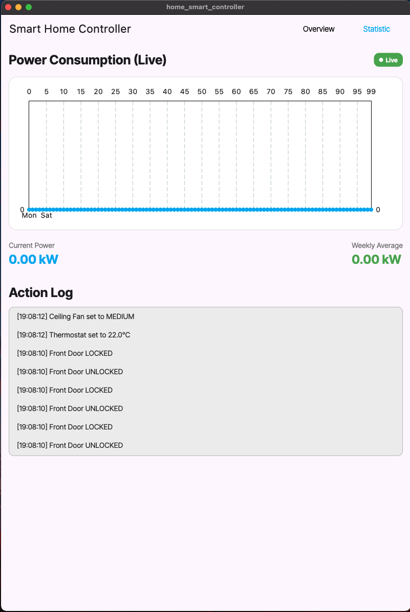

# Smart Home Controller

A modern Flutter desktop application for controlling and monitoring smart home devices in real-time.

## 🏠 Features

- **Device Control** - Light, Door, Thermostat, Ceiling Fan
- **Real-Time Power Monitoring** - Live power consumption chart (updates every 1 second)
- **Action Logging** - Timestamped device actions with filtering
- **Live Camera Feed** - MJPEG stream support
- **Statistics Dashboard** - Power analytics and usage trends

## 🚀 Quick Start

### Prerequisites
- Flutter SDK 3.9.2+
- macOS, Linux, or Windows

### Installation
```bash
git clone (https://github.com/TetRex/Smart-Home-Controller.git)
cd smart_home_controller
flutter pub get
flutter run -d macos  # or linux/windows
```

## 📦 Dependencies
```yaml
dependencies:
  flutter: sdk: flutter
  google_fonts: ^6.3.2
  window_manager: ^0.3.9
  video_player: ^2.8.0
  mjpeg_stream: ^1.0.0
  fl_chart: ^1.1.1
  provider: ^6.0.0
```

## 💡 Usage

**Home Page** - Control devices and monitor power in real-time
**Statistics** - View power consumption chart and filter action logs
**Details** - Access device-specific action history

## 🔌 Power Calculation

```
Total Power = Light (0.5kW) + Door (0.2kW) + Fan (Speed × 0.3kW) + Thermostat (Temp ÷ 10kW)
```

## 📱 Screenshots

### Home Page

*Device control with real-time power consumption*

### Statistics Page

*Live power chart and action log filtering*

### Details Page

*Device-specific action history*

## 🎨 Key Features

- ✅ Real-time device control
- ✅ Live power monitoring chart
- ✅ Timestamped action logging
- ✅ Device-based filtering
- ✅ Camera integration
- ✅ Provider state management

